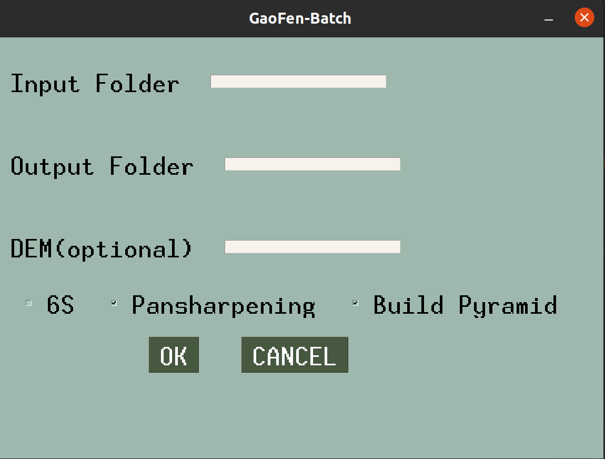

# Gaofen-Batch:
#### A batch preprocessing tool for Gaofen(高分) satellite imagery

>This project is still work in progress. Only GF1/2/6, GF1/B/C/D are supported yet.

**Hightlight**
- :wink: Support RPC orthorectification, radiometric correction, atmospheric correction, pansharpening, mosaic.
- :yum: Convenient to install dependence and easy to run.
- :heart_eyes: Fast speed comes with GDAL, minimize time costs by processing in parallel

### Installation
#### Linux and Windows

Install [Anaconda](https://docs.anaconda.com/anaconda/install/) or [miniconda](https://docs.conda.io/projects/conda/en/latest/user-guide/install/), execute this line.
```bash
conda create -n pre -c conda-forge gdal py6s pysimplegui
```

### Getting Started
#### Processing single dataset at one time
```bash
python /batch.py --InputFolder /InputFolder --OutputFolder /OutputFolder --_6S --pansharpen --pyramid
```
#### Processing multiple datasets in parallel
```bash
python /parallel_batch.py --InputFolder /InputFolder --OutputFolder /OutputFolder --_6S --pansharpen --pyramid --n_parallel 3
```
`/InputFolder` is where your raw datasets located,  `/OutputFolder` is where you store the preprecessed imagerys, `--_6S`, `--pansharpen` and `--pyramid` are optional depend on your needs.
For beginners, you can also just run `batch.py` and `parallel_batch.py` in an IDE, a simple but tolerable GUI will pop up to receive the parameters.




Test datasets are available at [GoogleDrive](https) and [Cloudflare](https)

### Acknowledgements

The 6S atmospheric correction module in this repository is based on [Zhaoguanhua](https://github.com/Zhaoguanhua/AtmosphericCorrection)'s work.
