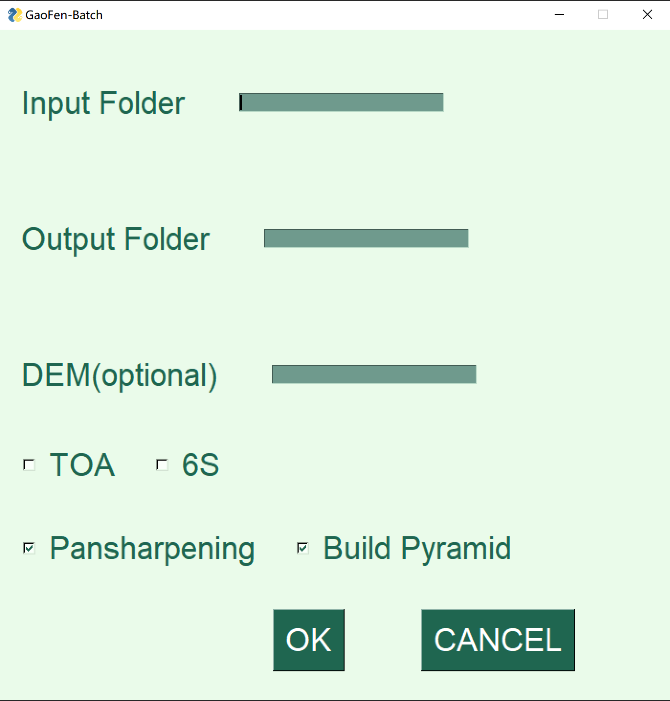

## 基于python的高分遥感数据一键批处理工具

>该工具仍在开发中，目前仅支持GF1/2/6，GF1B/C/D

**特点**
- :wink: 支持RPC正射校正，辐射定标，大气表观发射率（TOA）计算，6S大气校正，融合，镶嵌。
- :yum: 安装简单，运行方便。
- :heart_eyes: 默认多线程，可并行处理。

### 安装（Linux，Windows）

* 安装[Anaconda](https://docs.anaconda.com/anaconda/install/)或[miniconda](https://docs.conda.io/projects/conda/en/latest/user-guide/install/)
* 新建环境，安装依赖.
```bash
conda create -n pre -c conda-forge gdal rasterio py6s pysimplegui
```

### 使用
#### 运行单个程序，依次处理
```bash
python batch.py --InputFolder ./InputFolder --OutputFolder ./OutputFolder --TOA --_6S --pansharpen --pyramid
```
#### 运行多个程序，并行处理
```bash
python batch_parallel.py --InputFolder ./InputFolder --OutputFolder ./OutputFolder --TOA --_6S --pansharpen --pyramid --n_parallel 3
```
* `--InputFolder`是原始数据文件夹，`--OutputFolder`是处理结果文件夹。大气表观发射率计算`--TOA`，大气校正`--_6S`，融合`--pansharpen`，建金字塔`--pyramid`取决于后续实验需要
* 如果对命令行感到陌生，可以在IDE中运行`batch.py`或`parallel_batch.py`，会有一个简陋的界面弹出

* 

* 测试数据可通过[GoogleDrive](https://drive.google.com/drive/folders/1bdSWUnCdw3NZGtb9EpDPr4VY_z7sLmOX?usp=sharing)或[Cloudflare](https://icy-sun-e02a.genghisyang.workers.dev)获取

### 注意事项
* 要求32G以上内存，对于GF6-WFV的大气校正，需要64G以上内存
* 并行处理内存将占用多倍内存

### 鸣谢
* 本工具中6S大气校正模块引用 https://github.com/Zhaoguanhua/AtmosphericCorrection 在此感谢 Zhaoguanhua
